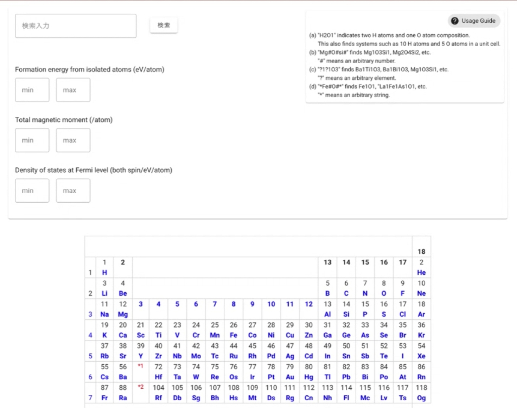
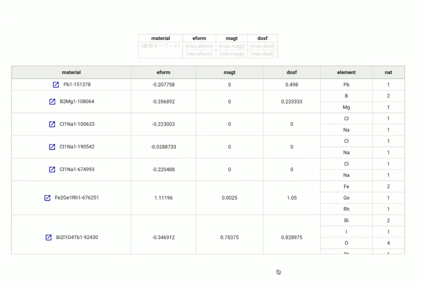

.. 操作マニュアル documentation master file, created by
   sphinx-quickstart on 2024.2.22.
   You can adapt this file completely to your liking, but it should at least
   contain the root `toctree` directive.

操作マニュアル
===================================================================================

.. toctree::
   :maxdepth: 3
   :caption: Contents:

.. _chapter02:

はじめに
===================================================================================

本ドキュメントは、DB Search UI 利用者向けです。
 
DB検索を行うために必要な情報を提供します。

ユーザー画面へのアクセス方法
---------------------------------------------------------------

下記URLにアクセスすることでご利用いただけます。

.. csv-table::
  :header-rows: 1
  :widths: 4, 6

   , URL
  DB Search UI, http://163.220.177.108/
   

ユーザー環境について
---------------------------------------------------------------
- OS
   - Mac OS 10.13 以上
   - Windows 10 以上
- WEBブラウザ
   - Windows：Edge 最新版，Google Chrome 最新版, FireFox 最新版
   - Macintosh： Safari 最新版，Google Chrome 最新版, FireFox 最新版

DB Search UI 利用方法
===================================================================================

物質DBの検索
---------------------------------------------------------------

検索したい物質を検索フォームに入力し検索ボタンをクリックすることで検索が行えます。

また、「eform」「magt」「dosf」の物理量を指定することで、検索結果の絞り込みも可能です。

.. csv-table::
   :header-rows: 1
   :widths: 4, 6

   項目, 説明
   （１）検索入力フォーム,  検索したい物質を入力してください。            
   （２）検索ボタン   ,  クリックすることで検索が実行できます。          
   （３）凡例      ,  検索する物質の記述方法になります。            
   （４）Formation energy from isolated atoms (eV/atom)   ,  範囲を入力することで、検索結果を絞り込めます 
   （５）Total magnetic moment (/atom)    ,  範囲を入力することで、検索結果を絞り込めます 
   （６）Density of states at Fermi level (both spin/eV/atom)    ,  範囲を入力することで、検索結果を絞り込めます  
   （７）元素周期表   ,  元素確認用の周期表です。                 

物質DBの検索結果
---------------------------------------------------------------

検索フォームに入力した条件に応じて、下記のような検索結果画面を出力します。
　

.. csv-table::
   :header-rows: 1
   :widths: 4, 6

   項目, 説明
   （１）material,  検索した物質名が表示されます。クリックすることで、物質の詳細ページに遷移します。
   （４）eform   ,  eformの値を表示します。
   （５）magt    ,  magetの値を表示します。
   （６）dosf    ,  dosfの値を表示します。
   （７）element   ,  構成する原子の情報が表示されます。

